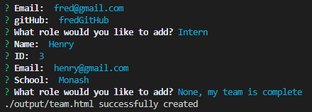

# Employee-Summary

# Title
  Team Generator

  ## Description
  quickly creates a html template for a new team from user input using node CLI

  ## Table of Contents  
  [Installation](#Installation)    
  [License](#License)  
  [Contributing](#Contributing)  
  [Demo](#Demo)  
  [Questions](#Questions)  
   

  ## Installation

  * Run npm i run node cli
  * Run app.js from node cli

  ## License
  MIT

  ## Contributing
  No

  ## Demo

  

  ## Questions
  GitHub: ldipaola
  Email: ldipaola66@gmail.com
